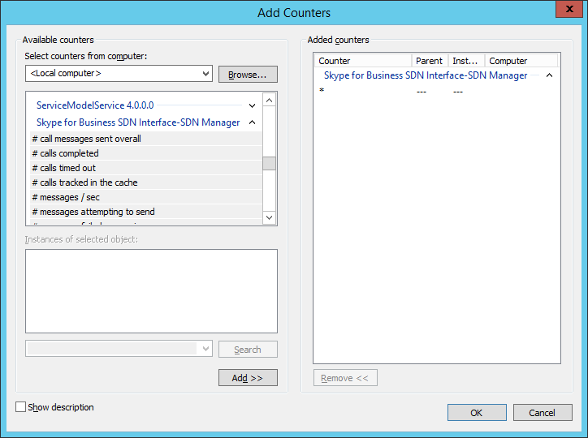

# SDN Manager and Dialog Listener performance counters

  
    
    

 **Applies to**: Lync Server 2013 | Skype for Business 2015

The SDN Manager and Dialog Listener provide performance counters that you can access using Perfmon. The performance counters are described in the following table and may be accessed using  [Perfmon](https://technet.microsoft.com/en-us/library/bb490957.aspx). 

**Figure 1. Performance counters for Dialog Listener and SDN Manager**

  

## SDN Manager performance counters

|**Performance counter**|**Description**|
|:-----|:-----|
|# Messages received |Total number of call related messages received |
|# call messages sent overall |Total number of call related messages sent successfully - counting every destination |
|# unique call messages sent |Total number of unique call related messages attempted to send (regardless of how many destinations) |
|# messages failed sending |Total number of send failures (regardless whether resending succeeded) |
|# undelivered messages |Total number messages that were not received at a destination - even with attempting to resend |
|# messages failed processing |Total number messages that failed during processing |
|# messages / sec |Number of messages sent per second |
|length of longest queue |Longest send message queue |
|# incoming messages / sec |Rate of incoming call related messages |
|# messages processing time (ms) |Processing time per message (ms) |
|# calls tracked in the cache |Number of messages currently in the state cache |
|# update collisions in the datastore |Number of colliding concurrent updates in the state cache |
|# of past due calls being processed |Number of calls being processed for a state update being past due |
|Average message delivery time |Time in milliseconds from attempting to send a message to actually receive a delivery confirmation (including resending attempts). |
|# messages attempting to send |Number of messages being attempted to send concurrently. |
|# calls completed |Number of calls completed. |
|# calls timed out |Number of calls completed with a timeout. |
|# calls completed/sec |Rate of calls completed per second. |
|# calls timed out/sec |Rate of calls timing out per second. |
|# messages timed out |(for version 2.4) Number of messages that failed transmission because of timeout. |
   

## Dialog Listener performance counters

****

|**Performance counter**|**Description**|
|:-----|:-----|
|# Messages received |Total number of call related messages received |
|# call messages sent overall |Total number of call related messages sent successfully - counting every destination |
|# unique call messages sent |Total number of unique call related messages attempted to send (regardless of to how many destinations) |
|# messages failed sending |Total number of send failures (regardless whether resending succeeded |
|# undelivered messages |Total number messages that were not received at a destination - even when there were attempts to resend them. |
|# messages failed processing |Total number messages that failed during processing |
|# messages / sec |Number of messages sent per second |
| length of longest queue|Longest send-message queue |
|# messages attempted to send |Number of messages currently attempted to send. |
|# messages attempted to send overall |Number of messages overall attempted to send. |
| Average message delivery time|Time in ms from attempting to send a message to actually receive a delivery confirmation (including resending attempts). |
|# messages timed out |(for version 2.4.1) Number of messages that failed transmission because of timeout. |
   

